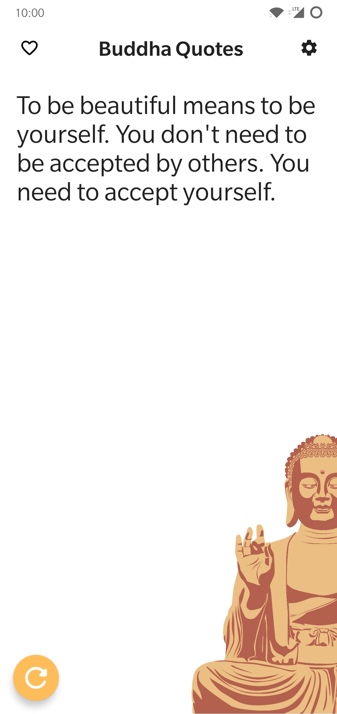
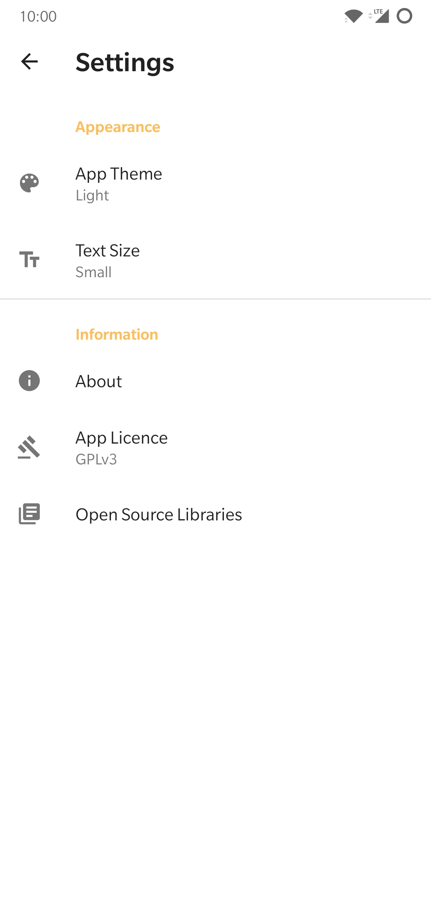

  

# Buddha Quotes

A collaborative project to create a Free and Open Source Buddha Quotes app for Android with a focus on privacy.

## Features

- Dark mode
- Over 200 quotes!
- Free and Open Source
- No ads
- No trackers
- No non-free dependencies like Google services
- Completely offline
- Small file size < 5MB!

## Screenshots

