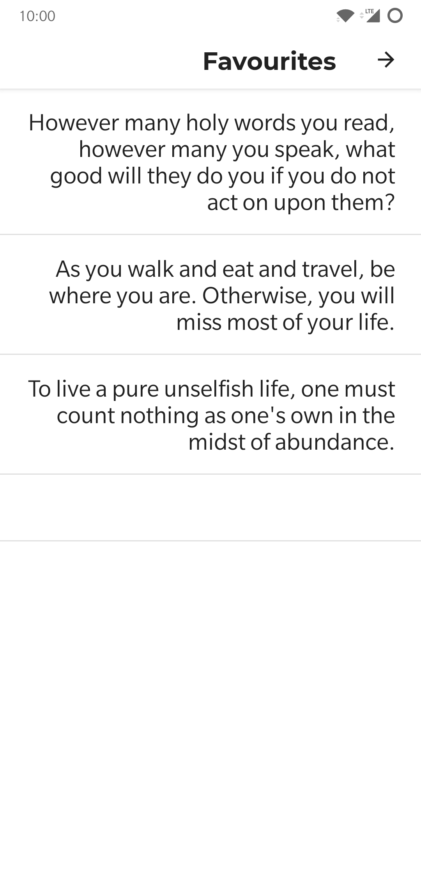
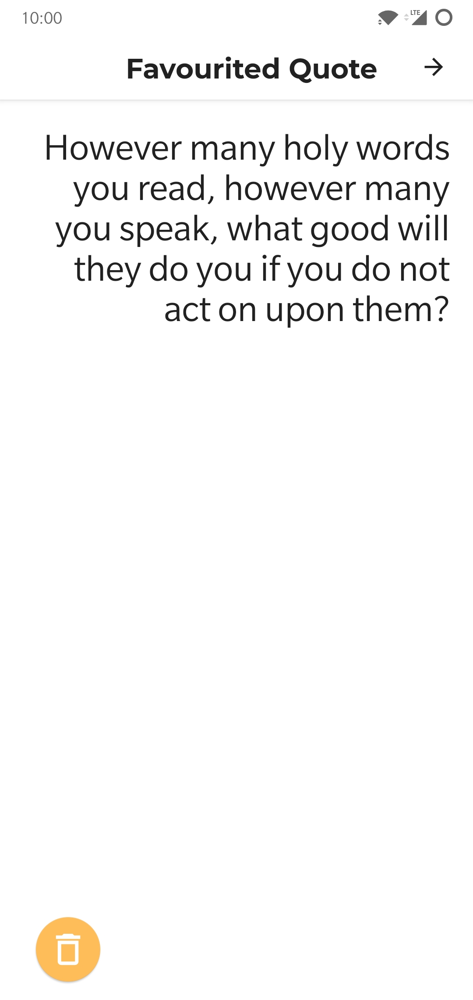
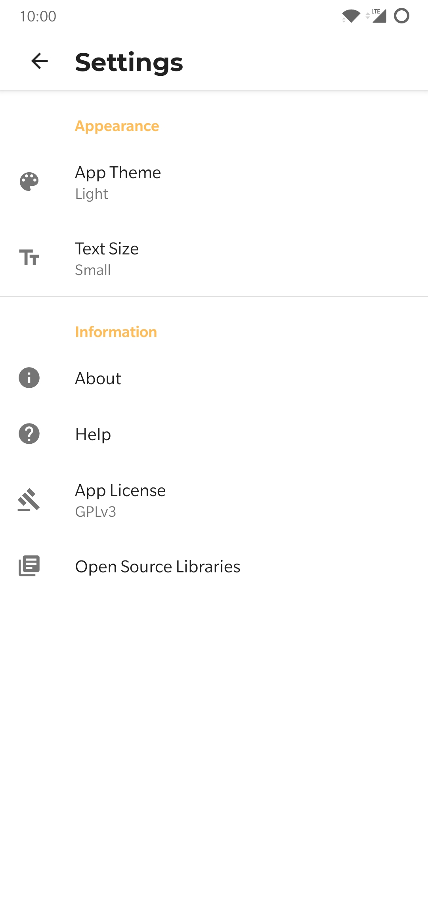
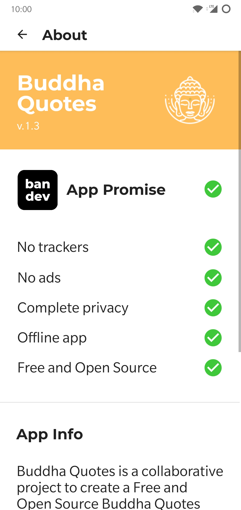
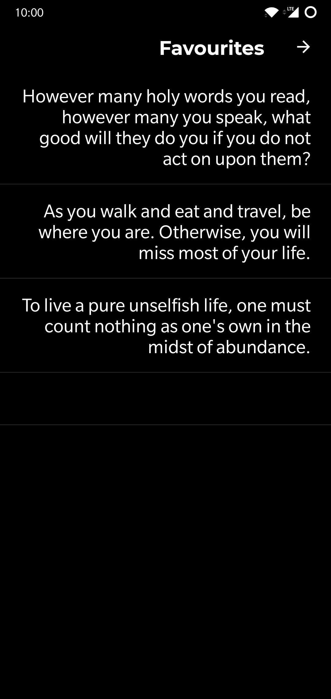
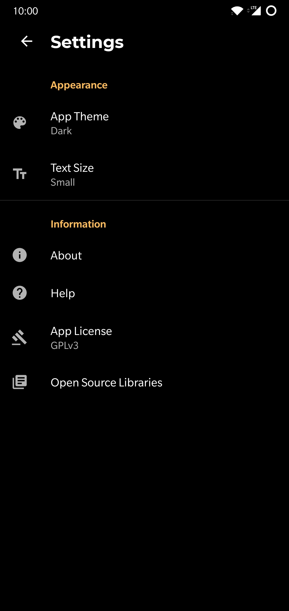

# Buddha Quotes   

A collaborative project to create a Free and Open Source Buddha Quotes app for Android with a focus on privacy.

## Features

- AMOLED mode
- Over 310 quotes!
- Favourite quotes
- Free, libre and open source
- No ads
- No trackers (verified using [ClassyShark3xodus](https://bitbucket.org/oF2pks/fdroid-classyshark3xodus/src/master/))
- No non-free dependencies like Google services
- Completely offline
- Small file size!

## Screenshots

## License
  

Buddha Quotes is Free Software: You can use, study share and improve it at your will. Specifically you can redistribute and/or modify it under the terms of the [GNU General Public License](https://www.gnu.org/licenses/gpl.html) as published by the Free Software Foundation, either version 3 of the License, or (at your option) any later version.  