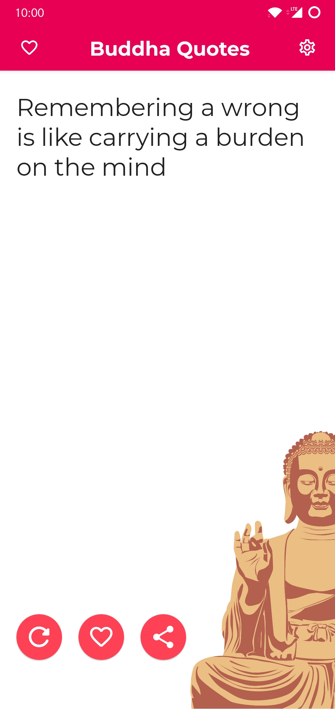
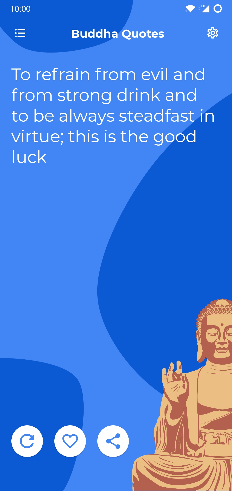
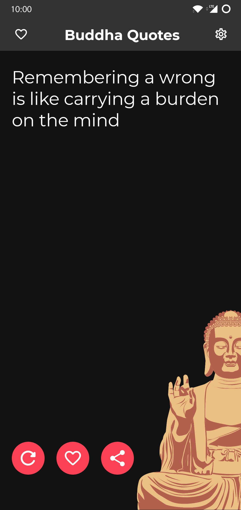
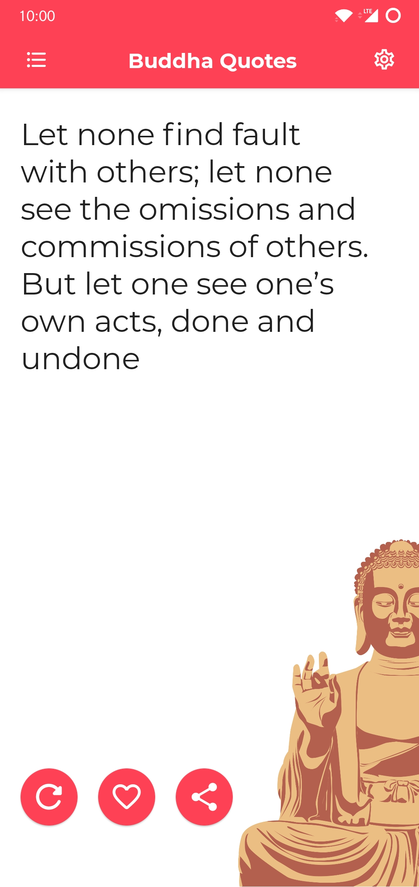
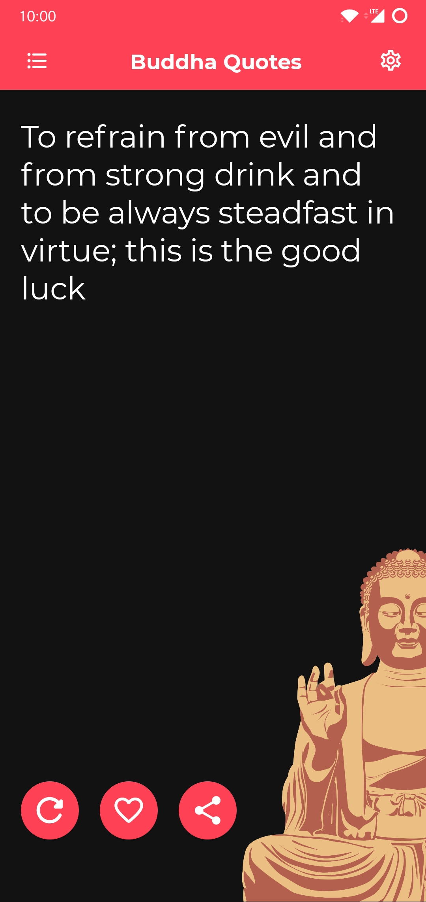
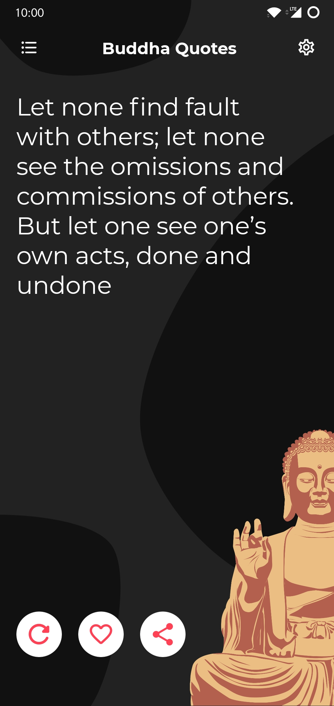
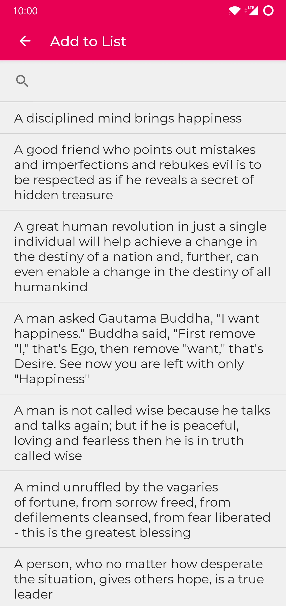
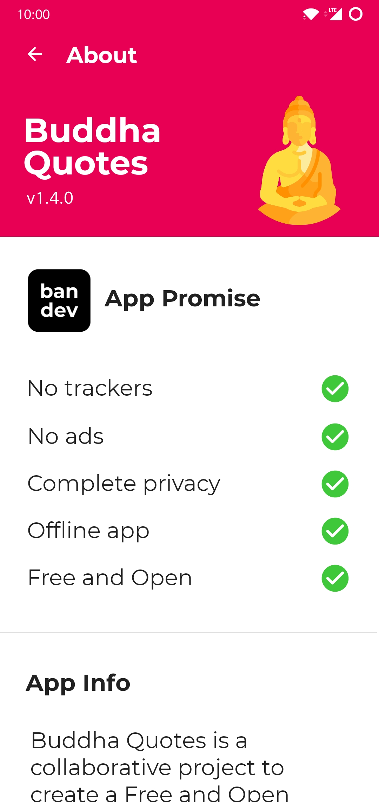

<h1>Buddha Quotes</h1>

  
    

    <strong>A collaborative project to create a Free and Open Source Buddha Quotes app</strong>
    

     
    

      
      
      

      

      
      

       

<h2 id="screenshots">Screenshots</h2>
<table>
<thead>
<tr>
<th style="text-align:center"></th>
<th style="text-align:center"></th>
<th style="text-align:center"></th>
<th style="text-align:center"></th>
</tr>
</thead>
<tbody>
<tr>
<td style="text-align:center"></td>
</tr>
</tbody>
</table>
<table>
<thead>
<tr>
<th style="text-align:center"></th>
<th style="text-align:center"></th>
<th style="text-align:center"></th>
<th style="text-align:center"></th>
</tr>
</thead>
<tbody>
<tr>
<td style="text-align:center"></td>
</tr>
</tbody>
</table>

<h2 id="features">Features</h2>
<ul>
<li>Dark mode</li>
<li>Over 230 quotes!</li>
<li>Add quotes to lists and favourites</li>
<li>Free, libre and open source</li>
<li>No ads</li>
<li>No trackers (verified using <a href="https://bitbucket.org/oF2pks/fdroid-classyshark3xodus/src/master/">ClassyShark3xodus</a>)</li>
<li>No non-free dependencies like Google services</li>
<li>Completely offline</li>
<li>Material Design</li>
</ul>

<h2 id="contributing">Contributing</h2>

Looking to contribute to Buddha Quotes? That&#39;s great! There are a couple of ways to help out. Translations, bug reports and pull requests are all greatly appreciated. Please refer to our <a href="https://gitlab.com/bandev/buddha-quotes/-/blob/master/CONTRIBUTING.md">contributing guidelines</a> to get started.

<h3 id="translations">Translations</h3>

You can help translate the app via our open source <a href="https://computub.com/bandev/localisation">localisation website</a>. Here is the link to the <a href="https://gitlab.com/bandev/bandev-localisation-project">repository</a>.

<h2 id="acknowledgements">Acknowledgements</h2>
<ul>
<li><a href="https://www.flaticon.com/authors/freepik">Launcher Icon</a> - Freepik via Flaticon</li>
</ul>

<h2 id="license">License</h2>

 Buddha Quotes is Free Software: You can use, study share and improve it at your will. Specifically you can redistribute and/or modify it under the terms of the <a href="https://www.gnu.org/licenses/gpl.html">GNU General Public License</a> as published by the Free Software Foundation, either version 3 of the License, or (at your option) any later version.  

